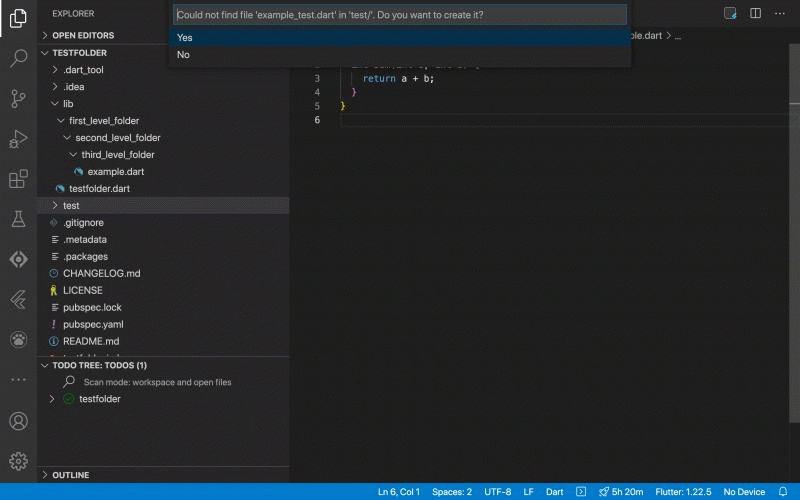
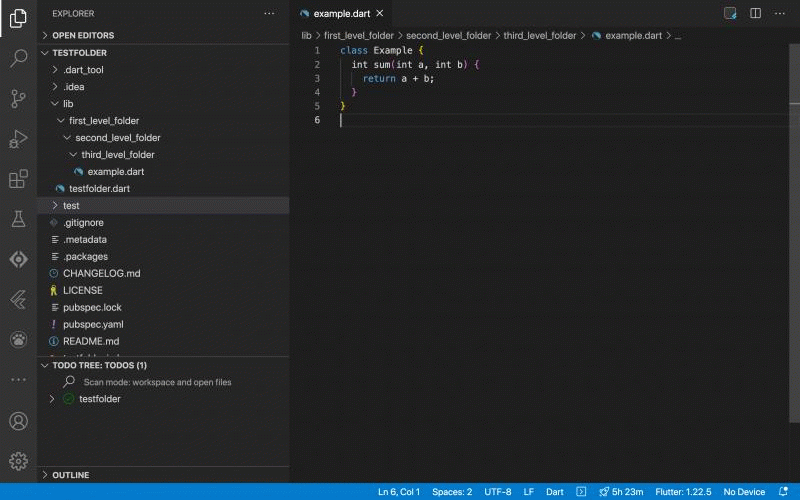

# README

**Improve the quality of your code by
accelerating your coding/testing workflow 🚀**

Boost your TDD-Workflow by:
* ✅ Creating a proper `xyz_test.dart` file with boilderplate code for an existing `xyz.dart` file with one click!
* ✅ Switching between `xyz.dart` file and the associated `xyz_test.dart` file instantly 
* ✅ Dramatically faster test execution  -> Run only the unit tests that affect the file you're currently working on.
* ✅ Using snippets to avoid writing boilderplate code

## Create test file or switch between tests and code with ⌘+T

## Execute Tests for the current file with ⌥+⌘+T

## Commands Summary

| Command ( + context menu)        | Shortcut | Description                                                  |
| -------------------------------- | -------- | ------------------------------------------------------------ |
| Better Tests: Go to tests        | ⌘+T      | Creates file `xyz_test.dart`  for file `xyz.dart` in the  `/test` folder. Will automatically create the necessary folder tree under `/test` to match the location of `xyz.dart` under `/lib`. If `xyz_test.dart` already exists, editor will show it. |
| Better Tests: Go to source file  | ⌘+T      | Opens the `xyz.dart` file if you are inside a `xyz_test.dart` file. |
| Better Tests: Run tests for file | ⌥+⌘+T    | Executes all tests inside of a `xyz_test.dart`. Works also if you are currently inside of `xyz.dart` |

## Snippets

| Snippet Prefix | Description                                            |
| -------------- | ------------------------------------------------------ |
| `ftest`        | Creates `test('<test-name>', () {<test-code>})`        |
| `fgroup`       | Creates `group('<group-name>', () {<multiple-tests>})` |
