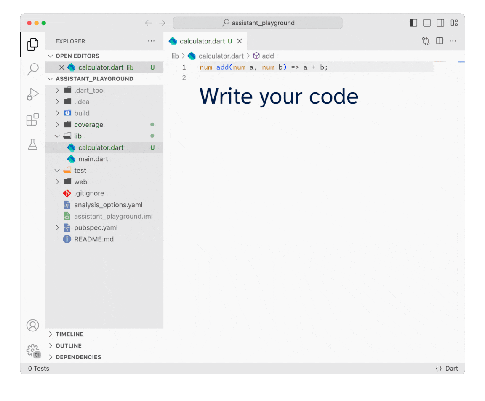

#  Flutter Tests Assistant

Improve the quality of your code by accelerating your coding/testing workflow 🚀

## Features

* Create a matching `{xyz}_test.dart` file with customized boilerplate test inside
* Switch between the implementation and test files with a [shortcut](#commands)
* Run tests for the code you're refactoring without leaving the source file
* Use handy test [snippets](#snippets)
* Keep `lib` and `test` directories in sync after renaming or moving the file in either

## Commands

| Command | Shortcut | Description |
| --- | --- | --- |
| Go to tests        | <kbd>Ctrl</kbd>+<kbd>Shift</kbd>+<kbd>T</kbd> <kbd>⌘</kbd>+<kbd>Shift</kbd>+<kbd>T</kbd> | Switch to the matching test file. The extension will create the test file, if necessary, after asking for the use-case. |
| Go to source file  | <kbd>Ctrl</kbd>+<kbd>Shift</kbd>+<kbd>T</kbd>   <kbd>⌘</kbd>+<kbd>Shift</kbd>+<kbd>T</kbd> | Switch to the source file. |
| Run tests for file | <kbd>Ctrl</kbd>+<kbd>Alt</kbd>+<kbd>Shift</kbd>+<kbd>R</kbd>   <kbd>⌥</kbd>+<kbd>⌘</kbd>+<kbd>Shift</kbd>+<kbd>R</kbd> | Executes all tests for the matching source file. |
| Generate test coverage | None | Executes all tests to gather test coverage information. |
| Toggle test coverage highlights | <kbd>Ctrl</kbd>+<kbd>Alt</kbd>+<kbd>Shift</kbd>+<kbd>C</kbd>   <kbd>⌥</kbd>+<kbd>⌘</kbd>+<kbd>Shift</kbd>+<kbd>C</kbd> | Shows/Hides text editor line decorations indicating test coverage. |

## Snippets

| Snippet prefix | Result                                            |
| -------------- | ------------------------------------------------------ |
| `ftest`        | Unit test |
| `fwidgettest`  | Widget test |
| `fgroup`       | Group of tests |
